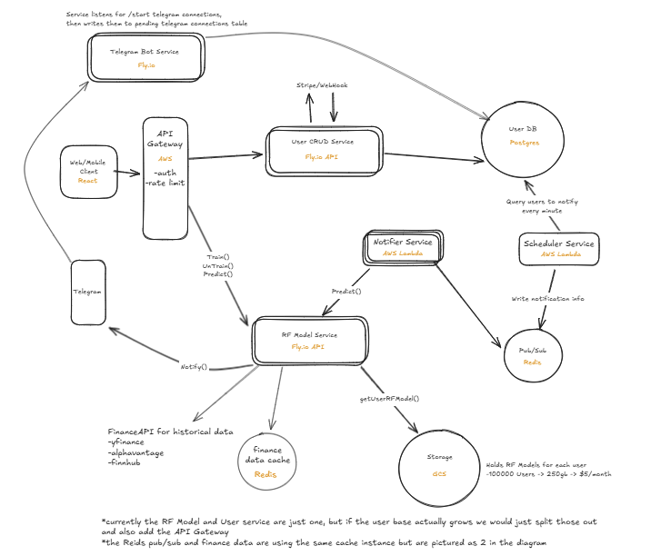
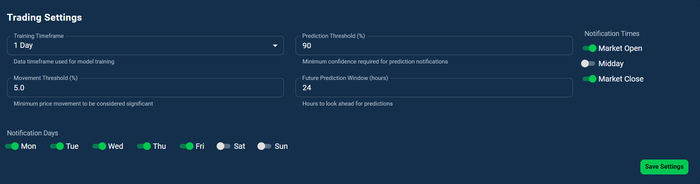
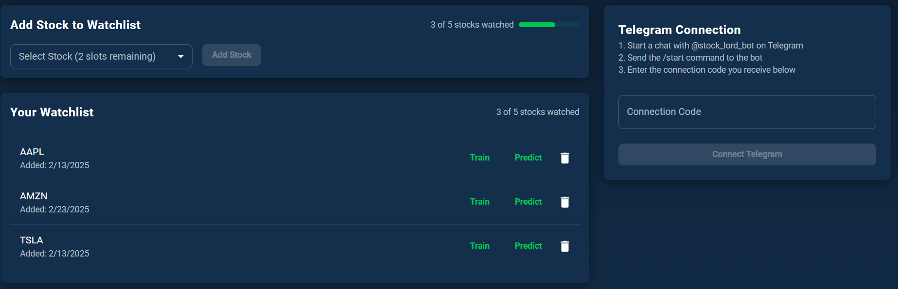
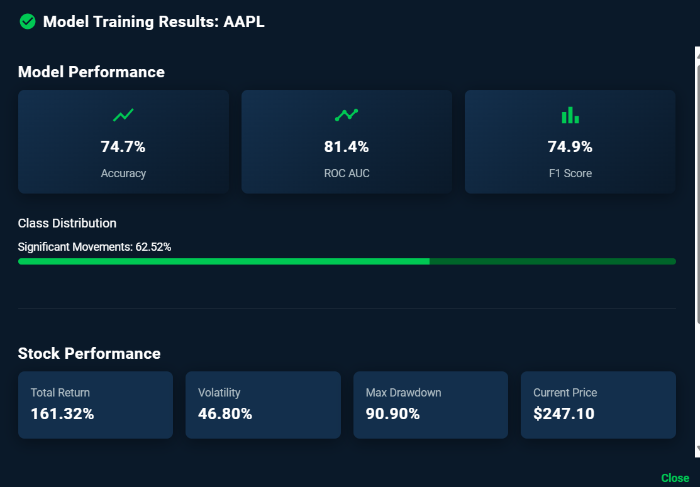

# Stock Movement Predictor

An ML-driven application that predicts significant stock price movements and sends push notifications. API available at https://stock-notifier-api.fly.dev/docs. To run, create an account with the `/auth/register` endpoint, copy the access token and enter that in the authorize button at the top of the swagger ui. To login, use the `/auth/token` endpoint. Other notable endpoints are the `/user/stocks` endpoint to add stocks to your profile, `/user/settings` to tweak your prediction needs, and `/tune` to train the model witht he best hyperparam configuration. Finally, `/predict` for new predictions on your saved stocks.

## Project Overview

The purpose of this project is to evaluate the effectiveness of using technical indicators as a predictive measure for a stock's future price. Additionally, it is an exercise in building a scalable software system which incorporates user customization and stock notifications. To accomplish these things we use a Random Forest classifier based on indicators such as RSI, bolling bands, MACD, and Volume. Instead of a typical regression task predicting a specific stock price, we are trying a binary classifier to predict a percentage movement over a user defined timeframe. For example, the user set a notification if with 90% certainty, a stock will move 3% in the 24 hours when trained on a daily or hourly timeframe. We employ a variety of technologies to make and push out predictions to users, such as Google Cloud Storage, Alpha Vantage APIs, Redis for caching stock data and pub/sub with notifications, AWS Lambda for triggering prediction notifications, telegram APIs for notifications themselves, and fly.io for quick microservice deployment.

## Feature Selection, Data, and Model

A big problem when training stock data is that the range of values for a technical indicator like bollinger bands or MACD greatly differs depending on the price so training multiple stocks into the same model or over many years may not be effective. To attempt to alleviate this, we use one model per stock for a user, and on the technical indicator side for bollinger bands we are going to calculate %b to reduce price dependency.
$$

\%B = \frac{\text{Current Price} - \text{Lower Band}}{\text{Upper Band} - \text{Lower Band}}

$$
For MACD we are doing the MAACD Histogram which factors the signal.
$$
\text{MACD Line} = \text{EMA}_{12} - \text{EMA}_{26}
$$
$$
\text{Signal Line} = \text{EMA}_{9}(\text{MACD Line})
$$
$$
\text{MACD Histogram} = \text{MACD Line} - \text{Signal Line}
$$
RSI is already a decent predictor of overbought/oversold conditions with values ranging from 0 to 100. Finally we will use volume. These features should provide good numbers for thresholding that occurs in the decision trees that are ensembled in Random Forests. For model selection we will use a Random Forest Classifier and fine tune the `n_estimators`, `max_depth`, and `max_features` hyperparameters with  Random Search in an attempt to get the most out of the model. Another problem we have with a lot of stocks is a very imbalanced data set with a large portion of the data being the positive movement class for small percentage thresholds and vice versa for large percentage thresholds. For example, a 4% movement over a 12 hour period will be very rare. An example of this, Tesla over a 15 year period is 88%/12% for movement above the 3% threshold. To counter this, proper stock threshold configurations is important for maximizing potential gains, and we will consider using SMOTE to artificailly generate the less frequent class. Additionally, stratified sampling may be useful. In reality, the `/tune` endpoint does not use SMOTE, but does use stratified sampling with `RandomizedSearchCV` and we find decent performance.

## Model Performance

The main training and performance evaluation happens in the `/tune` endpoint. We use `RandomizedSearchCV` to fine tune the RF hyperparameters and found that these values below generally give us the best performance with some variance depending on the stock:

| n_estimators   | max_features  | max_depth  |
|------------|------------|------------|
| 262 | log2 | 10 |

For the cross validation I use 5 folds and a 80/20 split for the final holdout set. Using the hourly or daily timeframe leads to better performance as there is many more data points available to train on than larger frames like the weekly. Certain stocks like Tesla have fairly even class distributions, but others lean heavily to one side especially when looking at larger movement thresholds so for this reason I used stratified sampling in the random search and passed on using SMOTE to generate additional samples for now. For the even class distributions I played with `roc_auc` as the evaluation metric and `average_precision` which acts as the precision recall AUC for the uneven distributions. Generally, I found about 70-80% roc-auc/pr-auc scores on the validation sets and final holdout set with similar performance indicating there is not too much overfitting or underfitting happening. This is certainly better than random chance. Typically the best features were MACD histogram, volume, and rsi with %b a bit behind. Below is an example set of data returned from the `/tune` call on Tesla.

```json
"status": "success",
"message": "Tuning completed for TSLA",
"symbol": "TSLA",
"tuning": {
"best_params": {
    "n_estimators": 262,
    "max_features": "log2",
    "max_depth": 10
},
"best_cv_score": 0.7360498454527068,
"cv_folds": 5,
"n_iter": 20,
"scoring": "average_precision"
},
"holdout_performance": {
"accuracy": 70.31,
"precision": 70.3,
"recall": 70.31,
"f1_score": 70.29,
"roc_auc": 78.69,
"class_metrics": {
    "no_movement": {
    "precision": 70.59,
    "recall": 72.73,
    "f1_score": 71.64,
    "support": 33
    },
    "significant_movement": {
    "precision": 70,
    "recall": 67.74,
    "f1_score": 68.85,
    "support": 31
    }
},
"class_distribution": {
    "no_movement": 51.56,
    "significant_movement": 48.44
},
"confusion_matrix": {
    "true_negative": 24,
    "false_positive": 9,
    "false_negative": 10,
    "true_positive": 21
},
"top_features": {
    "MACD_Hist_Z": 29.43,
    "RSI": 26.21,
    "Volume": 24.36,
    "PercentB": 20
},
"training_samples": 253,
"test_samples": 64
}
```

## Software System Design


### User/Model/Prediction service

The meat of the functionality exists in this service hosted at https://stock-notifier-api.fly.dev/docs. The user endpoints could be placed on its own service to reduce any potential tie up with model predictions and frontend user operations. This would be a task if the project ever saw real user load. With the model data, we are pulling stock prices from Alpha Vantage and Redis caching these prices until it is made stale by th etimeframe it is trained on. For example, if it is hourly data, we invalidate it after an hour since fresher data is available. Overall, this massively reduces API calls when doing mass predictions and reduces chances of hitting rate limits. Additionally, we are storing user models in local storage as long as there is available space, which reduces the amount of network load when doing mass predictions and loading/saving models stored in GCS.

### Notification Service

We are using Lambda to trigger notifications on a schedule. This works by querying all the users who have notifications enabled at the current time, puts them in a queue (Redis pub/sub), then multiple worker services pick them up, make the predictions and send the telegram message via Telegram's APIs. Additionally, we have a bot service that allows users to link their telegram accounts to their user accounts for this project.

## Future Improvement

### Sentiment Analysis

The results of the project show that technical indicators alone may boost odds greater than random chance, but its not necessarily a fully trustworthy option. It may be helpful to include sentiment analysis on a stock, assign a sentiment score, and include as another feature. For historical sentiment training we would likely need to use a third party that saves this data, but if we want to include it in up to date predictions and notifications this may involve scraping or paying for news feeds to vectorize and determine a postive, negative, neutral, or integer range score (for purposes of a random forest). This would require frequent polling and model retraining as news happens fast and sentiment can change on a dime.

### Vertex AI

We are already using GCP for storing models so it would make sense to use vertex for the prediction service. Batch predictions with vertex would likely simplify the notifications at scale and remove the complexity/bottleneck of the fly.io model predictor service. Better model versioning, while it does not necessarily fit into this project concept may be an option here also.

### Frontend

I built a small dashboard and authentication UI to add, train, and update notification settings, which is not included in this repo but a standalone tool that I was playing with. It would be nice to build out a more full fledged UI that abstracts the technicality of stock parameters and model training so the user can easily focus on increasing gains. Finally, some stripe subscription functionality was built, but finishing this implementation with customer portal and webhooks could make this a more full fledged tool, which a technically minded customer may want to subscribe to.



